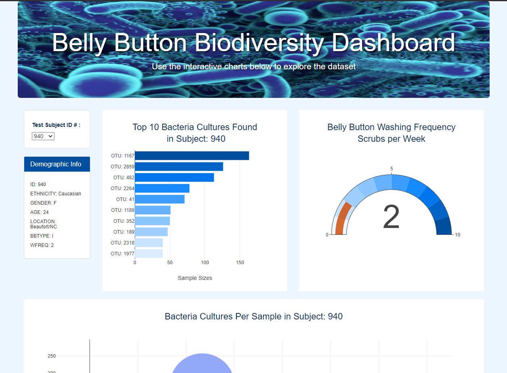

# Webpage Dashboard Data Visualization using JavaScript, Plotly.js, Bootstrap, HTML/Css
## Resources

- **Data Source:** [data.js](static_challenge/js/data.js)
- **Software:** JavaScipt, Plotly.js, HTML, CSS, D3, Visual Studio Code

## Challenge Project Overview 

Using JavaScript and Plotly.js, and HTML, I created an interactive data visualization on the web to explore the data on bacteria biodiversity of belly buttons, which could help create real tasting fake meat. D3.json() helped me fetch the external data from csv files and web APIs, which that data was then parsed and manipulated, so I could use event handlers to add interactivity to my data visualization.  Afterward, I then deployed my interactive chart on the Github Pages cloud server.  

**Check Out the Webpage:**
https://danielbrock4.github.io/Plotly.js_Data_Visualization_Belly_Button_Biodiversity/

**Result Webpages HTML Code:**
  - Webpage Filter Using Button [index_module.html](index_challenge.html)
  - Webpage Filter Using Search Bars [index_challenge.html](index_challenge.html)
 
**Webpage Preview**

